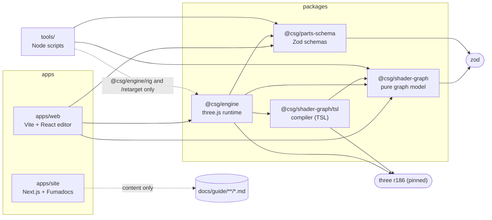
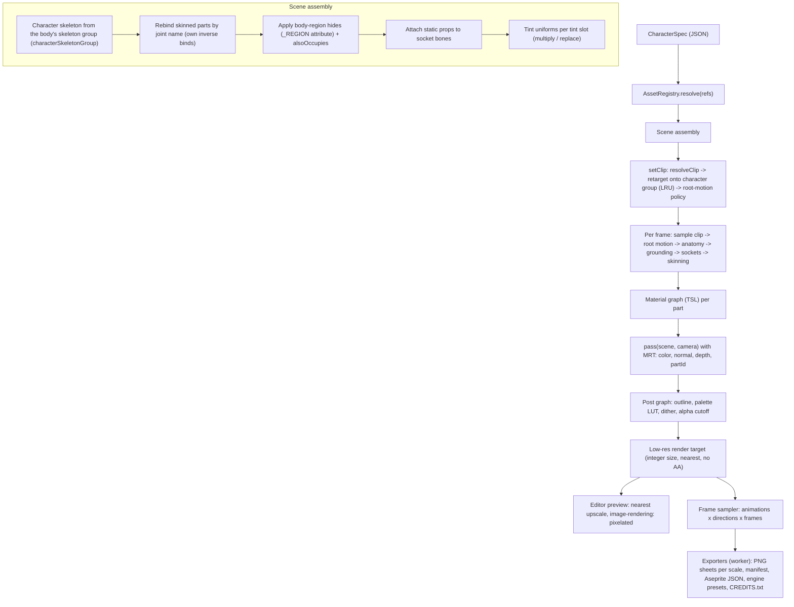
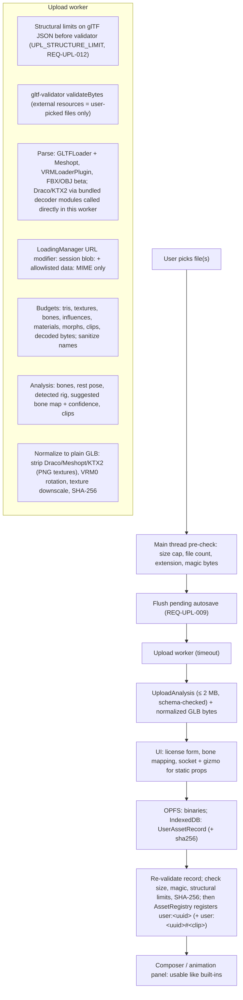

# Architecture

Status: Accepted (2026-10-08). Last synced with specs 001–011 on 2026-10-08 (fix-up FX-A: feature
folders, engine subpaths, lint rules, origin/CSP; fix-up FX-A2: security amendments to specs 000,
001, 007, 008 and 009) and with the M1 code on 2026-10-09 (M1-32: engine module layout, rig and
manifest fields, engine M1 API, asset build pipeline, texture loading under CSP). This is the
architecture source of truth for structure and dependency rules. Specs in `specs/` refine behavior
and contracts; ADRs in `docs/adr/` record why. If this document and a spec disagree, the spec wins
and this document must be updated in the same PR.

Spec and ADR status: the M1 rig spike (`tools/verify-rig.ts`) reported **mapped** (shared joint
names and hierarchy, four bind-pose skeleton groups); ADR-0008 records the outcome and the
resulting design (skeleton groups plus runtime retargeting). Specs follow their own status
headers. ADRs 0001–0008 stay `Accepted`; a change of decision is recorded as a dated amendment or a
superseding ADR.

## 1. Overview

Character Sprite Generator is a local-first browser app. Users compose a character from modular,
rigged 3D parts (CC0 Quaternius packs and their own uploads), tune anatomy and colors, pick
animations, and render the result through a pixel-art shader pipeline into sprite sheets. Two camera
families are first class: side-view (platformer) and top-down / 3/4 / isometric (RPG). Sprite
resolution is a user setting (32 to 128 px). Advanced users can edit the material and post-process
shaders in a node graph editor. A Next.js + Fumadocs website hosts the landing page and the user
guide, built from Markdown in `docs/guide/`.

Rationale for the big choices: ADR-0001 (3D to pixel), ADR-0002 (monorepo, gts), ADR-0003
(WebGPURenderer + TSL), ADR-0004 (React Flow), ADR-0005 (local-first uploads), ADR-0006 (specs),
ADR-0007 (website, amended for the hosting origin), ADR-0008 (shared rig with skeleton groups and
runtime retargeting).

### 1.1 Packages

Workspace scope: `@csg/*` (all packages `private: true` until a 1.0 publishing decision).

| Path | Package | Runtime | Responsibility |
|------|---------|---------|----------------|
| `packages/parts-schema` | `@csg/parts-schema` | any (Node, browser, worker) | Zod schemas + inferred types for every persisted document except graphs: `SlotDefinition` registry, `PartManifest`, `RigDefinition` (canonical rigs in `rigs/<rigId>.json`), `ClipManifest`, `CharacterSpec`, `AnatomyPreset`, `RenderSettings`, `ExportSettings`, `AssetLicense`, `UserAssetRecord`, `BoneMapPreset`, `ProjectDocument`. Canonical JSON. Migrations. JSON Schema generation. No three.js. |
| `packages/shader-graph` | `@csg/shader-graph` | any | Pure graph model: `ShaderGraphDocument` schema, socket type registry and cast table, node type metadata (`NodeTypeSpec`), validation, migrations, `GraphCommand`s, copy/paste (`ShaderGraphClip`), URL encoding (`#g=`). No three.js, no React. |
| `packages/shader-graph` (subpath) | `@csg/shader-graph/tsl` | browser/worker with three | Compiler: graph document to TSL node expressions via `NodeEmitter`s. Depends on `three` (peer, pinned). |
| `packages/engine` | `@csg/engine` | browser + worker | three.js runtime. Built in M1 (`src/`): `contracts/` (type-only API), `loaders/` (GLB loader, URL policy, `_REGION`, `` textures), `registry/` (asset registry, compatibility, rest poses), `composition/` (character skeleton, rebinding, sockets, tints, region hides, assembly, `evaluatePose`), `anatomy/`, `animation/` (sample times, clip player, root motion, retarget adapter), `retarget/` and `rig/` (DOM-free math), `renderer/` (backend with fallback, preview scene and clock). Later: `RenderPipeline` (pixel pipeline), frame sampler, exporters (pure, worker), upload validation (worker), local storage adapters. Implements `CompileContext`. Framework-agnostic (no React). Module layout: §4.8. |
| `packages/engine` (subpaths) | `@csg/engine/rig`, `@csg/engine/retarget` | any (Node, browser, worker) | DOM-free rig math and retarget math (`src/rig/`, `src/retarget/`; `retarget/` is also three-free), exposed through `package.json` `exports` so `tools/` can use them without the browser runtime (rule 6). |
| `apps/web` | `@csg/web` | browser | Vite + React editor. Feature folders under `src/features/` are exactly: composer, anatomy, animation, look, export, shader-graph, upload. The shell (single `/app/` route, layout, history, command/shortcut registry, preferences) and the preview viewport live in `src/app/`, which is not a feature. Owns UI state; not rendering. |
| `apps/site` | `@csg/site` | Node build, static output | Next.js App Router landing page + Fumadocs docs from `docs/guide/**`. |
| `tools/` | (workspace scripts) | Node | Asset build `assets:build` (`tools/build-parts.ts` + `tools/lib/build/`, `gltf-transform`, spec 011, §2.3), `assets:check` and `assets:licenses` (`tools/check-assets.ts`, `tools/generate-licenses.ts` + `tools/lib/check/`), `assets:verify-rig` (`tools/verify-rig.ts`, rig report), `fixtures:build`, JSON Schema export, `spec:check` / `spec:trace`. Depends on `@csg/engine` but imports only `@csg/engine/rig` and `@csg/engine/retarget`. |

### 1.2 Dependency directions



Rules (enforced by lint import restrictions configured in T9; violating them fails CI):

1. Arrows point from consumer to dependency. No cycles. Nothing depends on `apps/*` or `tools/`.
2. `@csg/parts-schema` and `@csg/shader-graph` (root entry) never import `three`, React, or DOM
   APIs. They run in Node for tools and tests.
3. Only `@csg/shader-graph/tsl` and `@csg/engine` import `three`. The compiler does not know about
   scenes or the pipeline; it compiles against a `CompileContext` interface that the engine
   implements (dependency inversion, so the compiler never imports the engine).
4. `apps/web` renders only through `@csg/engine`. It may import `three` **types** (`import type`)
   but not create renderers, materials or scenes. Gizmos (TransformControls) and node previews are
   engine APIs.
5. `apps/site` has no runtime dependency on workspace packages in v1. It reads Markdown from
   `docs/guide`. A later interactive demo links to the editor (a framed editor does not open
   persisted data, §4.10), not engine code, to keep the site build independent of WebGPU.
6. The engine exposes DOM-free subpath exports `@csg/engine/rig` (`src/rig/`) and
   `@csg/engine/retarget` (`src/retarget/`). Those folders import neither DOM APIs nor browser-only
   engine modules. `tools/` may import only these two subpaths from `@csg/engine`; any other
   `@csg/engine` specifier in `tools/` fails lint.
7. Exporters (`packages/engine/src/export/`) import neither three.js nor DOM APIs, run in a worker
   and are unit-tested in Node (spec 005). Lint-enforced by an import restriction on that folder.
8. `apps/web` feature isolation: a folder in `src/features/<feature>/` never imports another
   feature or `src/app/`; features may import `src/shared/` and packages. `src/app/` composes
   features. ESLint boundary zones are derived by glob from `apps/web/src/features/*`, so adding a
   feature folder needs no lint config change.
9. Determinism lint: `Date.now`, `performance.now` and `Math.random` are banned in
   `packages/engine/src/{pipeline,sampler}/**` and `packages/shader-graph/src/tsl/**` (§4.1).
   `innerHTML` and `dangerouslySetInnerHTML` are banned in `apps/web` (§4.6).

## 2. Data flow

### 2.1 Render path



Details:

- **Assembly is diff-based** (REQ-CMP-033). `setCharacter(spec)` compares with the previous spec:
  changing a tint updates a uniform; changing anatomy updates bone scales; swapping a part
  loads/rebinds only that part. Full rebuild only when the body (skeleton) changes.
- **Skeleton groups** (ADR-0008, REQ-CMP-037). The character skeleton is built from the rest pose
  of the body's `characterSkeletonGroup` (else its `skeletonGroup`, else
  `rig.defaultSkeletonGroup`; `characterSkeletonGroupOf` in `registry/rest-pose.ts`). Every skinned
  mesh, the body included, is rebound to it by joint name and keeps its own `boneInverses`, so a
  part of another group renders with its bind delta and is never rejected for it.
- **Clip retargeting** (REQ-ANM-023, ADR-0008). `ClipPlayer.setClip` retargets a clip whose
  `skeletonGroup` differs from the character's, using the DOM-free `@csg/engine/retarget` math
  (rest-pose-corrected rotations, hip and root translation scaled by the leg-length ratio, other
  translations dropped, scale passed through). Results are cached per player (LRU,
  `RETARGET_CACHE_SIZE` = 16, key `${clipRef}|${skeletonGroupId}`); a same-group clip or identity
  plan is used as is. Retargeted clips interpolate linearly.
- **Per-frame application order** is fixed by spec 002 (Data & contracts) and implemented by
  `evaluatePose` (`composition/evaluate-pose.ts`): reset all bones to rest, 1) sample the
  (already retargeted) clip by absolute seek (spec 004), 2) root-motion policy (applied once at
  `setClip`, nothing per frame), 3) anatomy with child compensation, 4) grounding offset on the
  skeleton root, 5) socket props (`updateSockets`), 6) skinning at draw.
- **Material graph** (per part, default = toon ramp 2 to 4 bands + rim + tint) is compiled once per
  distinct graph structure and shared across parts. Exposed params are `uniform()` nodes created
  through `CompileContext.uniform()`.
- **Post graph** runs inside one `RenderPipeline` with a single MRT scene pass. `outputColorTransform`
  is disabled; color space conversion happens explicitly before palette quantization so the LUT
  sees the colors the user sees.
- **Frame sampler** (export): sample times are a pure function of `AnimationSelection` (REQ-ANM-007,
  absolute seek). A first pass computes the union bounding box over all requested frames and
  directions, then fixes the orthographic camera and pivot (`pivotRowPx`, column `floor(width/2)`)
  for the whole sheet. Model yaw follows `DIRECTION_ORDER` (spec 003). Root translation is snapped
  to the texel size. Readback via `renderer.readRenderTargetPixelsAsync`.
- **Exporters** are pure functions over `RenderedFrame[]` (no three.js), so they are unit-testable
  in Node.

M1 state: the M1 renderer (`createCharacterRenderer`, §3.6) runs assembly, clip playback and
`evaluatePose`, and draws an unlit preview scene directly (no `RenderPipeline`, no material or
post graphs; those are M2/M4).

### 2.2 Upload path



Nothing is sent to a server at any step. Workers communicate with transferable `ArrayBuffer`s and
serializable reports only (three.js objects are not transferred). Stored user GLBs never need a
decoder at load time (§4.10). FBX/OBJ handling and the full threat model are specified in spec 008.
With `DEDICATED_ORIGIN=false` the store step is skipped and assets live for the session only
(REQ-GEN-009, §4.10).

### 2.3 Asset build path (`pnpm assets:build`, spec 011)

`tools/build-parts.ts` orchestrates pure stages in `tools/lib/build/` over gltf-transform
`Document`s (I/O at the edges, sorted iteration, no timestamps; exit 0 ok, 1 build failure, 2 usage
or source problem). Per pack:

1. `config`: load `tools/packs/<packId>/pack.config.json` (Zod). `sources`: SHA-256 tree hash of
   `assets-src/<dir>/` (vendor folder name from `tools/asset-sources.json`) against the recorded
   hash (REQ-AST-024).
2. Load the canonical rig `packages/parts-schema/rigs/<rigId>.json` (`AST_RIG_MISSING` if absent).
3. `split`: one document per part (its meshes, full skeleton, own materials and textures) and per
   clip (skeleton + one animation).
4. Per item: `normalize` (REQ-AST-011), then `skeleton`: classify into one of
   `rig.skeletonGroups` (REQ-AST-026; structural mismatch fails with `AST_RIG_MISMATCH`, no or
   ambiguous group match warns `AST_SKELETON_GROUP_UNMATCHED`).
5. Skinned parts: `region` writes the `_REGION` vertex attribute (bodies, REQ-AST-012/025), and
   `influences` keeps the 4 largest weights per vertex (REQ-AST-027, `AST_INFLUENCES_LIMITED`).
   All parts: `textures` enforces the texture budget.
6. `optimize`: dedup, prune, weld, resample (1e-4), PNG texture resize, reorder, Meshopt
   (`EXT_meshopt_compression`, quantize). Bundled texture sides are **512 px for bodies and 256 px
   for other parts**, below the REQ-AST-010 maxima (1024 / 512), to keep the repo within budget;
   that is ample for 32–128 px sprites. No Draco, no KTX2.
7. Clips: duration and `hasRootMotion` from the root bone's horizontal travel; a clip without a
   group match records `rig.defaultSkeletonGroup` (`AST_CLIP_GROUP_DEFAULTED`). Files above 3 MB
   warn `AST_BUDGET_FILE_SIZE`.
8. `emit`: `assets/packs/<packId>/{manifest.json, clips.json, parts/, clips/, retired-ids.json}`
   with computed fields (`file`, `rig`, `skeletonGroup`, `sha256`, `stats`, `durationSec`,
   `hasRootMotion`); the manifest embeds the rig (incl. `skeletonGroups`).

`pnpm assets:check` (`tools/lib/check/run.ts`, REQ-AST-020) runs without `assets-src/`: manifest,
clip manifest and pack config schemas; licenses; staleness against the config and canonical rig
(`AST_MANIFEST_STALE`); `validatePartsAgainstRig`; per file SHA-256, budgets (triangles, textures,
4 influences), stats and `_REGION` validity; each built skinned GLB re-verified against its
declared skeleton group (non-reference group = warning `AST_BIND_POSE_DIFFERS`); clip rig, group
and bone targets; thumbnails (warning); orphans and symlinks; ID stability against
`retired-ids.json`; the default character + default clips size (AC-AST-016.2); and the generated
section of `ASSETS_LICENSE.md` (`assets:licenses` regenerates it).

## 3. Core contracts

The canonical definitions are Zod schemas in `@csg/parts-schema` and `@csg/shader-graph` with
types derived by `z.infer`. The TypeScript below mirrors the specs; where a spec section is the
detailed source, this section gives a short interface and points to it. Field names are binding.
When a spec changes a contract, this section is updated in the same PR.

### 3.0 Spec index

| Contract | Package | Source of truth |
|----------|---------|-----------------|
| `HexColor`, `AssetRef`, `TransformOffset`, `AssetLicense` | parts-schema | §3.1 below; `HexColor` normalization: spec 001 Data & contracts (refinement 3) |
| `SlotId`, `SlotDefinition` (slot registry) | parts-schema | spec 001 REQ-CMP-001, Data & contracts |
| `PartEntry`, `PartManifest` | parts-schema | spec 001 Data & contracts; generated fields: spec 011 REQ-AST-013 |
| `RigDefinition`, skeleton groups | parts-schema | spec 002 Data & contracts; derivation: spec 011 REQ-AST-005; groups: REQ-AST-026, REQ-CMP-037; ADR-0008 |
| `AnatomyParams` (ranges), `AnatomyPreset`, per-frame order | parts-schema / engine | spec 002 Data & contracts |
| `CharacterSpec`, canonical JSON, `#c=` share | parts-schema | spec 001 Data & contracts, REQ-CMP-022, REQ-CMP-025, REQ-CMP-034/035 |
| `ClipRef`, `ClipEntry`, `ClipManifest`, `AnimationSelection`; retargeting | parts-schema / engine | spec 004 Data & contracts, REQ-ANM-023 |
| `RenderSettings` (except `animations`), `DIRECTION_ORDER`, defaults, palettes | parts-schema | spec 003 Data & contracts |
| Reserved built-in param IDs (`RenderSettings` field ↔ graph binding) | shader-graph | spec 007 *Reserved built-in param IDs*, REQ-SGF-041 |
| `ExportSettings`, `ExportContext`, `ExportProgress`, `SpriteSheetExport`, `SpriteExportManifest`, file names | parts-schema / engine | spec 005 Data & contracts |
| `ShaderGraphDocument`, `GraphNode/Edge/Param/Group/Frame`, `ShaderGraphClip`, `NodeTypeSpec`, `NodeEmitter`, `CompileContext`, `CompileError`, `CompileResult`, root API | shader-graph | spec 007 Data & contracts, Type system, Error registry; limits REQ-SGF-034/035, emitter hardening REQ-SGF-042 |
| `GraphCommand`, `LookPreset`, `SocketVisual`, node catalog | shader-graph / web | spec 006 Data & contracts, Node catalog |
| `UploadLimits` / `DEFAULT_UPLOAD_LIMITS`, `DEFAULT_ARCHIVE_LIMITS`, `ALLOWED_DATA_URI_MIME`, `RESERVED_NAMES`, `UploadErrorCode`, `UploadAnalysis` and `UserAssetRecord` additions (incl. `sha256`), `BoneMapPreset`, `.csglib.zip` / `.csgproj.zip` | engine / parts-schema | spec 008 Data & contracts |
| `CommandDef`, `ShortcutDef`, `HistoryEntry`, `UiPrefs`, `TabMessage`, `RecoveryMarkers`, IndexedDB stores, routing | web | spec 009 Data & contracts, REQ-UX-022..024, REQ-UX-029, REQ-UX-045, REQ-UX-048, REQ-UX-049 |
| `pack.config.json`, `RigReport`, asset output layout | tools | spec 011 Data & contracts |
| Engine M1 contracts (registry, loaders, composition, anatomy, animation, renderer) | engine | `packages/engine/src/contracts/` (type-only), §3.6 |
| Error code prefixes | all | spec 000 Area-prefix registry |

### 3.1 Shared primitives and licensing

```ts
/** Lowercase 6-digit sRGB hex, e.g. '#a0c4ff' (spec 001: stored lowercase). */
export type HexColor = `#${string}`;

/** Reference to a part or decal: built-in pack part or a local user upload (`user:<uuid>`). */
export type AssetRef = `builtin:${string}/${string}` | `user:${string}`;

export interface TransformOffset {
  position: [number, number, number];
  /** Euler XYZ in degrees (human-editable). */
  rotationDeg: [number, number, number];
  scale: [number, number, number];
}

export type LicenseId = 'CC0-1.0' | 'CC-BY-4.0' | 'CC-BY-SA-4.0' | 'own-work' | 'other';

export interface AssetLicense {
  license: LicenseId;
  author: string;
  title?: string;
  sourceUrl?: string;
  /** Derived for built-ins; user-declared for uploads. Drives export warnings. */
  commercialUse: 'yes' | 'no' | 'unknown';
  attributionRequired: boolean;
  notes?: string;
}
```

### 3.2 Slots, rigs and parts manifest

Slots are data (P-11): `SlotId` is a registry-validated string, not a closed union. The v1 registry
lists 15 slots in display order `body, hair, eyebrows, beard, face, headwear, torso, arms, hands,
legs, feet, back, accessory, prop-main-hand, prop-off-hand` (spec 001 REQ-CMP-001, full table in
its Data & contracts).

```ts
export type RigId = string; // e.g. 'quaternius-ue5-65'
/** Skeleton group ID, unique within a rig, e.g. 'superhero-m', 'male', 'female', 'ual'. */
export type SkeletonGroupId = string;
/** Joint name as in the source skeleton, [A-Za-z0-9_.:-]{1,64}; not renamed (decision D1, e.g. 'Head'). */
export type JointName = string;

/** Validated against the slot registry; [a-z0-9-]{1,32}. */
export type SlotId = string;

export interface SlotDefinition {
  id: SlotId;
  label: string; // i18n message key
  order: number;
  kinds: Array<'skinned' | 'static'>;
  required: boolean; // true only for 'body'
  defaultSocket?: SocketId;
  randomize: {emptyChance: number}; // 0..1; body = 0
}

export type BodyRegion =
  | 'head' | 'hair' | 'neck' | 'torso' | 'upper-arms' | 'lower-arms'
  | 'hands' | 'pelvis' | 'upper-legs' | 'lower-legs' | 'feet';

export type TintSlot = 'skin' | 'hair' | 'eyes' | 'primary' | 'secondary' | 'metal' | 'leather';

/** Socket IDs; RigDefinition.socketBones maps each to a joint (e.g. head -> 'Head'). */
export type SocketId = 'hand_r' | 'hand_l' | 'head' | 'spine_03' | 'pelvis';

/** Local rest transform of one joint: translation, quaternion xyzw, scale. */
export interface RestTransform {
  t: [number, number, number];
  r: [number, number, number, number];
  s: [number, number, number];
}

/** One bind/rest-pose variant of the rig (spec 011 REQ-AST-026, ADR-0008). */
export interface SkeletonGroup {
  id: SkeletonGroupId;
  /** A rest transform for every bone. */
  restPose: Record<JointName, RestTransform>;
}

/**
 * Spec 002. Canonical files: packages/parts-schema/rigs/<rigId>.json, generated by
 * `assets:verify-rig` from tools/rigs/<rigId>.overlay.json (spec 011 REQ-AST-005).
 * Embedded in every PartManifest. Unknown fields round-trip.
 */
export interface RigDefinition {
  id: RigId;
  comment?: string;
  /** Joint names in hierarchy order (parents before children). */
  bones: JointName[];
  /** Joint used as the root for yaw and translation snapping (null parent). */
  rootBone: JointName;
  /** Local axis along which each bone's length runs. */
  lengthAxis: 'x' | 'y' | 'z';
  /** Anatomy control -> joints; all nine controls, none empty (hand-edited overlay). */
  anatomyBones: Record<keyof AnatomyParams, JointName[]>;
  /** Body region -> joints, disjoint; used for hides and _REGION (hand-edited overlay). */
  regionBones: Record<BodyRegion, JointName[]>;
  /** Socket ID -> joint. `pelvis` is the hip used by grounding and retargeting (no hipBone field). */
  socketBones: Record<SocketId, JointName>;
  skeletonHeightM?: number;
  /** Joint -> parent joint; exactly one null (rootBone). */
  parents: Record<JointName, JointName | null>;
  /** Rest poses of the skeleton groups; IDs unique; at least one. */
  skeletonGroups: SkeletonGroup[];
  /** Reference group; one of skeletonGroups[].id. Fallback character skeleton. */
  defaultSkeletonGroup: SkeletonGroupId;
}

export interface PartSocket {
  bone: SocketId;
  offset: TransformOffset;
  /** Spec 002: whether the prop follows the socket bone's anatomy scale. */
  inheritScale?: boolean;
}

/** Spec 001 Data & contracts. Computed fields are written by build-parts (spec 011 REQ-AST-013). */
export interface PartEntry {
  /** Stable within the pack; never reused (retired-ids.json). */
  id: string;
  name: string;
  slot: SlotId;
  kind: 'skinned' | 'static';
  /** Path relative to the pack base URL (GLB). */
  file: string;
  /** Node/mesh name inside the GLB when one file holds many parts. */
  node?: string;
  /** Required for kind 'skinned'. */
  rig?: RigId;
  /** Computed: skeleton group of the file (REQ-AST-026); skinned parts. */
  skeletonGroup?: SkeletonGroupId;
  /** Authored, slot 'body' only: group whose rest pose builds the character skeleton (REQ-CMP-037). */
  characterSkeletonGroup?: SkeletonGroupId;
  /** Only for parts in slot 'body': the fit group outfits target, e.g. 'regular'. */
  bodyType?: string;
  /** Body regions of the base body hidden while this part is equipped. */
  hides: BodyRegion[];
  /** Other slots this part also fills (e.g. robe: torso + legs). */
  alsoOccupies?: SlotId[];
  /** Material name in the GLB mapped to a tint slot. Unmapped materials keep their texture. */
  tintSlots: Array<{material: string; slot: TintSlot; mode?: 'multiply' | 'replace'}>;
  /** Required for kind 'static'. */
  socket?: PartSocket;
  /** Compatibility filters (REQ-CMP-008). Empty/absent = all. */
  bodies?: string[]; // body part ids
  bodyTypes?: string[]; // body fit groups
  /** Path relative to the pack base URL. */
  thumbnail?: string;
  /** SHA-256 of `file`. */
  sha256: string;
  stats: {triangles: number; textures: number};
  tags: string[];
  /** Overrides the pack license when present. */
  license?: AssetLicense;
}

export interface PartManifest {
  format: 'sprite-parts-manifest';
  version: 1;
  packId: string; // e.g. 'quaternius-ubc'
  name: string;
  license: AssetLicense;
  rigs: RigDefinition[];
  parts: PartEntry[];
}
```

Compatibility (REQ-CMP-008, `registry/compatibility.ts`), checked in order: (a) a skinned part
shares the body's `rig`, else reason `rig`; (b) `bodies` is empty or contains the body id, else
`body`; (c) `bodyTypes` is empty or contains the body's `bodyType`, else `body-type`. Skeleton
groups are deliberately not compared (each mesh keeps its own inverse binds, REQ-CMP-037); fits
that depend on the bind pose, such as gendered hair and outfits, are authored as `bodies`
(ADR-0008). Static props are rig-agnostic.

### 3.3 Character spec, clips and project document

```ts
/** Spec 002: unitless multipliers, quantized to 0.01; ranges in spec 002. */
export interface AnatomyParams {
  height: number;
  head: number; // chibi bias
  torsoWidth: number;
  shoulders: number;
  armLength: number;
  legLength: number;
  hands: number;
  feet: number;
  limbThickness: number;
}

export interface PartSelection {
  ref: AssetRef;
  /** Per-part tint overrides; falls back to CharacterSpec.tints. */
  tints?: Partial<Record<TintSlot, HexColor>>;
  /** Only for static parts; overrides the manifest socket/offset. */
  socket?: PartSocket;
}

/** Spec 001 Data & contracts. Clip selection is NOT part of the character (see RenderSettings). */
export interface CharacterSpec {
  format: 'sprite-character';
  version: 1;
  name: string; // 1..64 chars
  /** uint32 seed used by randomize (mulberry32); stored so a result is reproducible. */
  seed: number;
  /** The body part defines the skeleton. Always present (CMP_BODY_MISSING). */
  body: PartSelection;
  /** Keys are non-body SlotIds in registry order; absent key = empty slot. */
  parts: Record<SlotId, PartSelection>;
  anatomy: AnatomyParams;
  /** Morph target weights by name, where the body provides them (spec 002). */
  morphs: Record<string, number>;
  /** All 7 tint slots required. */
  tints: Record<TintSlot, HexColor>;
  face?: {decal: AssetRef | null; offsetPx: [number, number]};
}

/**
 * Clip reference (spec 004). Bundled: `builtin:<packId>/<clipId>`.
 * User upload: `user:<uuid>#<clipName>` (spec 008 REQ-UPL-047).
 */
export type ClipRef = `builtin:${string}/${string}` | `user:${string}#${string}`;

/** Spec 004 Data & contracts. Computed fields are written by build-parts. */
export interface ClipEntry {
  id: string; // [a-z0-9-]{1,64}, never reused
  name: string;
  category: 'locomotion' | 'combat' | 'reaction' | 'death' | 'emote' | 'misc';
  file: string; // relative to the pack base URL
  /** Animation name inside the GLB. */
  sourceName: string;
  rig: RigId;
  durationSec: number;
  loop: boolean;
  defaultFrameCount: number; // 1..64
  hasRootMotion: boolean;
  /** Clip id of the in-place variant. */
  inPlaceVariant?: string;
  tags: string[];
  license?: AssetLicense;
  /** SHA-256 of `file`; cache key with the URL (REQ-ANM-021). */
  sha256: string;
  /** Skeleton group of the clip's source rest pose (REQ-AST-026); drives retargeting. */
  skeletonGroup: SkeletonGroupId;
}

/** Bundled clip catalog, `assets/packs/<packId>/clips.json`. */
export interface ClipManifest {
  format: 'sprite-clips-manifest';
  version: 1;
  packId: string;
  name: string;
  license: AssetLicense;
  clips: ClipEntry[];
}

export interface ProjectDocument {
  format: 'sprite-project';
  version: 1;
  character: CharacterSpec;
  render: RenderSettings;
  export: ExportSettings;
  /** Embedded (user-edited) graphs keyed by id; built-ins are referenced by 'builtin:' ids. */
  graphs: Record<string, ShaderGraphDocument>;
}
```

Persistence and sharing: canonical JSON (keys in schema order, `parts` in registry order) for save
and share (spec 001 refinement 5). Character share links use `#c=<base64url(deflate-raw(json))>`
and never contain `user:` refs (REQ-CMP-025/026); graph share links use `#g=` (REQ-SGF-035).
Missing `builtin:` refs empty the slot (REQ-CMP-024); missing `user:` refs are kept and block export
(REQ-UPL-048). Decode caps for both fragments: §4.2.

### 3.4 Render and export settings

Spec 003 owns `RenderSettings` except `animations`, which spec 004 owns (spec 003 types it as
`AnimationSelection[]`). Defaults per camera preset are in spec 003 Data & contracts. The binding of
typed `RenderSettings` fields to graph params is the spec 007 *Reserved built-in param IDs* table
(see §3.5).

```ts
export type CameraPreset = 'side' | 'three-quarter' | 'isometric' | 'custom';

/** Counter-clockwise from screen-right (spec 003). */
export const DIRECTION_ORDER = ['e', 'ne', 'n', 'nw', 'w', 'sw', 's', 'se'] as const;
export type DirectionLabel = (typeof DIRECTION_ORDER)[number];

/** Spec 004 Data & contracts. */
export interface AnimationSelection {
  clipId: ClipRef;
  /** Unique within the export; [a-z0-9-]{1,48}; used for frame/tag/file names (spec 005). */
  label: string;
  frameCount: number; // 1..64
  fps: number; // 1..60
  loop: boolean;
  pingPong?: boolean; // default false
  bakePingPong?: boolean; // default false; only with pingPong
  timing?: 'fit' | 'fixed-fps'; // default 'fit'
  range?: {startSec: number; endSec: number};
  rootMotion?: 'in-place' | 'metadata'; // default 'in-place'
  directionOverrides?: Record<number, ClipRef>; // P3
}

/** Spec 003 Data & contracts (value ranges and defaults there). */
export interface RenderSettings {
  resolution: {width: number; height: number}; // integers 32..128
  camera: {
    preset: CameraPreset;
    elevationDeg: number; // used only for 'custom'; presets 0 / 35 / 30
    framing: 'auto' | number; // number = world units per pixel
    pivotRowPx: number; // from the bottom
  };
  directions: 1 | 2 | 4 | 8;
  /** Facing used when directions = 1. */
  singleFacing: DirectionLabel;
  /** [P2] Mirror e/ne/se into w/nw/sw instead of rendering them. */
  mirrorWest: boolean;
  /** Owned by spec 004 (AnimationSelection); 1..32 entries in user order. */
  animations: AnimationSelection[];
  lighting: {azimuthDeg: number; elevationDeg: number; ambient: number};
  toon: {
    bands: 2 | 3 | 4;
    thresholds?: number[];
    rim: {enabled: boolean; strength: number; width: number};
  };
  outline: {
    outer: {enabled: boolean; widthPx: 1 | 2 | 3};
    inner: {
      enabled: boolean;
      partId: boolean;
      depth: boolean;
      normal: boolean;
      depthThresholdPx: number;
      normalThresholdDeg: number;
    };
    colorMode: 'black' | 'darken' | 'custom';
    darkenAmount: number;
    color?: HexColor; // required when colorMode = 'custom'
  };
  /** Graph ids into ProjectDocument.graphs or built-ins ('builtin:material-toon', 'builtin:post-default'). */
  materialGraph: string;
  postGraph: string;
  /**
   * Values for user-declared graph params only, keyed by GraphParam.id (no '.').
   * Reserved dotted IDs (spec 007) take their values from the typed fields above, never from here.
   */
  params: Record<string, number | boolean | HexColor | [number, number, number]>;
  palette: {
    id: 'none' | 'pico-8' | 'endesga-32' | 'custom';
    colors?: HexColor[]; // required when id = 'custom', 1..256, unique
    metric: 'oklab' | 'srgb';
    dither: {mode: 'none' | 'bayer2' | 'bayer4' | 'bayer8'; strength: number};
  };
  alphaCutoff: number; // 0.01..1
}

/** Spec 005 Data & contracts (defaults and ranges there). */
export interface ExportSettings {
  baseName?: string;
  layout: 'grid-by-animation' | 'strip-per-animation' | 'frames-zip';
  rowOrder: 'clip-major' | 'direction-major';
  maxColumns: number | null; // 1..256; null = no wrap
  /** Non-empty, unique, ascending. Default [1]. (Was `scale`.) */
  scales: Array<1 | 2 | 4 | 8>;
  paddingPx: number; // 0..16
  marginPx: number; // 0..16
  powerOfTwo: boolean;
  extrudePx: number; // 0..2
  metadata: 'none' | 'json' | 'aseprite-json';
  pngColorType: 'rgba' | 'indexed';
  enginePreset: 'none' | 'godot4' | 'phaser3' | 'unity' | 'tiled';
  previews: {gif: boolean; apng: boolean; scale: 1 | 2 | 4 | 8};
  includeCredits: true; // always true; CREDITS.txt is mandatory
}
```

`ExportContext`, `ExportProgress`, `SpriteSheetExport` and `SpriteExportManifest` are in §3.6.

### 3.5 Shader graph document

Owned by `@csg/shader-graph`. Full contract, type system (incl. `genType` resolution and the
implicit cast table), error registry and root API (`parseGraph`, `serializeGraph`, `canConnect`,
`encodeGraphUrl`/`decodeGraphUrl`, `compileGraph`, `registerNodeType`) are in spec 007 Data &
contracts. Editor commands (`GraphCommand`) and `LookPreset` are in spec 006 Data & contracts.

**Param and uniform keys** (spec 007 *Reserved built-in param IDs*, REQ-SGF-041; the table is not
repeated here):

- Typed `RenderSettings` fields (toon, rim, lighting, outline, dither, alpha cutoff, palette) bind
  to graphs only through **reserved param IDs**, which always contain a `.` (e.g. `toon.bands`,
  `alpha.cutoff`). Each has a binding kind (`uniform`, `field` or `builtin`) and a fixed type; a
  `GraphParam` with a reserved ID but a wrong kind or type fails validation with
  `SGF_RESERVED_PARAM`.
- User-declared param IDs match `[A-Za-z][A-Za-z0-9_-]{0,63}` (no `.`) and are the only keys in
  `RenderSettings.params`.
- Inline (unconnected) input uniforms are keyed `node:<nodeId>.<socketId>`, so they never collide
  with param keys.

```ts
export type SocketType = 'float' | 'int' | 'bool' | 'vec2' | 'vec3' | 'vec4' | 'color' | 'texture';
/** As declared by a node type; 'genType' resolves per instance (REQ-SGF-013). */
export type SocketTypeRef = SocketType | 'genType';
/** `namespace.name@version`, e.g. 'toon.ramp@1'. Migrations run per type. */
export type NodeTypeId = `${string}@${number}`;

export interface GraphNode {
  id: string; // [A-Za-z0-9_-]{1,64}, unique in its scope
  type: NodeTypeId;
  pos: [number, number];
  /** Unconnected input values keyed by stable socket id (never array index). */
  inputs: Record<string, unknown>;
  label?: string;
  collapsed?: boolean;
  muted?: boolean;
  preview?: boolean;
  hideUnused?: boolean;
  group?: string; // 'group.instance@1' only: key into ShaderGraphDocument.groups
  param?: string; // 'param.get@1' only
  [unknownField: string]: unknown; // preserved on round trip
}

export interface GraphEdge {
  from: [nodeId: string, socketId: string];
  to: [nodeId: string, socketId: string];
  [unknownField: string]: unknown;
}

export interface GraphParam {
  /** Stable. User id [A-Za-z][A-Za-z0-9_-]{0,63} (value in RenderSettings.params) or a reserved dotted id (spec 007). */
  id: string;
  name: string;
  type: Exclude<SocketType, 'texture'>;
  default: unknown;
  min?: number;
  max?: number;
  step?: number;
  group?: string; // blackboard section
  description?: string;
  /** Shown in the simplified Look panel (REQ-EDT-034). */
  exposeInLook?: boolean;
}

export interface GroupSocket {
  id: string;
  name: string;
  type: SocketTypeRef;
  default?: unknown;
}

export interface GraphGroup {
  name: string;
  interface: {inputs: GroupSocket[]; outputs: GroupSocket[]};
  nodes: GraphNode[];
  edges: GraphEdge[];
  params: GraphParam[];
  /** Shipped stage this group came from; enables "reset to default". */
  origin?: `builtin:${string}`;
}

export interface GraphFrame {
  id: string;
  label: string;
  color?: string;
  rect: [x: number, y: number, w: number, h: number];
  nodeIds: string[];
}

export interface ShaderGraphDocument {
  format: 'sprite-shadergraph';
  version: 1;
  target: 'material' | 'post';
  name?: string;
  nodes: GraphNode[];
  edges: GraphEdge[];
  params: GraphParam[];
  groups: Record<string, GraphGroup>;
  /** UI-only; ignored by the compiler and by structureHash. */
  ui: {
    viewport?: {x: number; y: number; zoom: number};
    frames?: GraphFrame[];
    blackboardOrder?: string[];
  };
  [unknownField: string]: unknown;
}

/** Pure metadata (root entry, no three). Full field list: spec 007. */
export interface NodeTypeSpec {
  type: NodeTypeId;
  label: string;
  category: string; // 'input' | 'math' | 'vector' | 'color' | 'toon' | 'post' | 'utility' | 'output' | 'group' | ...
  description: string;
  targets: Array<'material' | 'post'>;
  inputs: Array<{
    id: string;
    label: string;
    type: SocketTypeRef;
    default?: unknown;
    /** Registry bounds; authoritative for clamping (REQ-SGF-042). Required on loop/sample-bound sockets. */
    min?: number;
    max?: number;
    /** Allowed values for enum sockets (REQ-SGF-042). */
    values?: readonly string[];
    defaultBuiltin?: string;
    connectOnly?: boolean;
  }>;
  outputs: Array<{id: string; label: string; type: SocketTypeRef; previewable?: boolean}>;
  backends?: Array<'webgpu' | 'webgl2'>; // default: both
  /** True if the emitter samples a texture; counted against the 32-sample limit (REQ-SGF-034). */
  samplesTexture?: boolean;
  migrateFrom?: (old: GraphNode) => GraphNode;
}

/** TSL side (@csg/shader-graph/tsl). TslNode = three's TSL node type. Pure: same inputs => same graph. */
export interface NodeEmitter {
  type: NodeTypeId;
  compile(
    ctx: CompileContext,
    inputs: Readonly<Record<string, TslNode>>,
    node: Readonly<GraphNode>,
  ): Record<string, TslNode>;
}

/** Implemented by @csg/engine; consumed by the compiler. */
export interface CompileContext {
  target: 'material' | 'post';
  mode: 'preview' | 'export' | 'node-preview';
  backend: 'webgpu' | 'webgl2';
  /** Built-in inputs ('uv', 'scene.color', 'tint.<slot>', 'render.paletteLut', ...; list in spec 007).
   *  Unknown name throws (-> SGF_EMIT_FAILED). */
  builtin(name: string): TslNode;
  /** Creates or reuses a uniform keyed by a stable id: a param id (user or reserved) or `node:${nodeId}.${socketId}` for inline values. */
  uniform(key: string, type: SocketType, initial: unknown): TslNode;
}

export interface CompileError {
  nodeId?: string;
  innerPath?: string[]; // path inside groups
  socketId?: string;
  severity: 'error' | 'warning';
  code: string; // spec 007 error registry
  message: string;
}

export interface CompileResult {
  ok: boolean;
  /** Final TSL node(s); opaque outside the engine. */
  output?: unknown;
  /** Uniform handles keyed by param id; setting .value needs no recompile. */
  uniforms: Record<string, {value: unknown}>;
  errors: CompileError[];
  /** Hash of structure (nodes, edges, types) used to cache compiled programs. */
  structureHash: string;
}
```

Copy/paste uses `ShaderGraphClip` (`format: 'sprite-shadergraph-clip'`, spec 007). Graph files are
`<name>.csgraph.json`.

**Limits and emitter hardening** (spec 007 is normative). REQ-SGF-034 rejects a document with
`SGF_LIMIT_EXCEEDED` above 2,000 nodes (incl. groups), 8,000 edges, 256 params, 64 groups, nesting
depth 8, 2 MB JSON, 4,000 **flattened** nodes, or 32 texture-sample nodes on the live path to the
output. The flattened count is computed **before** flattening by memoized per-group multiplication
of instance counts, so a rejected document is never materialized; texture samples are nodes whose
`NodeTypeSpec.samplesTexture` is `true`, counted per flattened instance after dead-node removal.
REQ-SGF-042: loop, kernel and sample bounds clamp to the registry `min`/`max` (document
`GraphParam.min`/`max` are UI hints only); enum inputs must be in the registry `values` or fall back
to the default with `SGF_VALUE_CLAMPED`; document strings and IDs never reach shader source or TSL
names.

### 3.6 Engine public API surface

#### 3.6.1 What M1 exports

The barrel `packages/engine/src/index.ts` re-exports every type of `src/contracts/` and the
modules `loaders`, `registry`, `composition`, `anatomy`, `animation`, `renderer`, `rig` and
`retarget`. The entry points apps use:

```ts
/** registry/asset-registry.ts */
export function createAssetRegistry(options?: {loader?: GlbLoader}): EngineAssetRegistry;

export interface EngineAssetRegistry extends AssetRegistry {
  readonly loader: GlbLoader; // exposes fetchCount
  /** Engine view: parsed scene (own boneInverses, regionId attribute) + rig. */
  resolve(ref: AssetRef): Promise<Result<LoadedPartInternal, EngineError>>;
  /** Lets clips resolve without a part pack; part packs register their embedded rigs. First wins. */
  registerRig(rig: RigDefinition): void;
  partEntry(ref: AssetRef): PartEntryView | undefined;
  clipEntry(ref: ClipRef): ClipEntryView | undefined;
}

/** renderer/character-renderer.ts. WebGPU, else WebGL2; neither -> PIX_BACKEND_UNAVAILABLE. */
export function createCharacterRenderer<R extends PreviewRenderer = WebGPURenderer>(
  canvas: HTMLCanvasElement | OffscreenCanvas,
  options: CharacterRendererOptions<R>, // forceWebGL?, previewScale?, registry: AssemblyRegistry, slots?, factory?, onError?
): Promise<Result<EngineCharacterRenderer<R>, EngineError>>;

/** The M1 subset of CharacterRenderer (3.6.2) plus preview controls. */
export interface EngineCharacterRenderer<R> extends CharacterRenderer {
  readonly renderer: R;
  readonly preview: PreviewScene; // scene, camera, direction stage
  readonly assembly: CharacterAssembly;
  readonly timeSec: number;
  readonly playing: boolean;
  /** null = continuous at the clip's duration; else step through export frames (REQ-ANM-018). */
  setPreviewTiming(timing: PreviewTiming | null): void;
  playClip(clipId: ClipRef, rootMotion?: RootMotionMode): Promise<Result<void, EngineError>>;
  resize(width: number, height: number): void; // CSS px / previewScale
  draw(): void;
}

/** composition/evaluate-pose.ts: reset to rest, then the spec 002 order (2.1). Deterministic. */
export const evaluatePose: (context: PoseContext, timeSec: number) => void;
// PoseContext = {body: BodySkeleton; player: ClipPlayer; anatomy: AnatomyBinding;
//                props: readonly AttachedPart[]; params: AnatomyParams}
```

M1 `CharacterRenderer` implements `backend`, `setCharacter`, `play`, `pause`, `seek`,
`setDirection` (yaw per `DIRECTION_ORDER`, `e` = screen-right, AC-PIX-005.1) and `dispose`; the
other members of §3.6.2 do not exist yet. Known M1 limits: tinting mutates the registry's cached
part scenes (one renderer per registry), and per-part tint overrides, morphs and `alsoOccupies`
are not applied (M3). Registry user-asset methods throw `not implemented (M5)`.

Engine-level lifecycle error: `ENGINE_DISPOSED` (exported from `composition/character-assembly.ts`)
is returned as a `Result` error, never thrown, by `setCharacter`, `setClip` and `playClip` when
called after `dispose()` or when `dispose()` happens while they are still loading. It is not tied
to a spec area prefix (there is no `ENGINE` prefix in the registry of spec 000); callers treat it
as "this renderer is gone" and drop the result.

Other notable exports: `checkCompatibility`, `characterSkeletonGroupOf`, `restPoseOf`
(registry); `createBodySkeleton`, `attachSkinnedPart`, `attachStaticPart`, `updateSockets`,
`createCharacterAssembly`, tint and region-mask helpers (composition); `createClipPlayer`
(`RETARGET_CACHE_SIZE`), `retargetClip`, `stripRootMotion`, `computeSampleTimes` (animation);
`createGlbLoader` (Meshopt decoder only, Draco and KTX2 refused), `registerImageElementTextures`,
`isAllowedAssetUrl` (same-origin and `blob:` only) (loaders); `createRetargetPlan`,
`retargetTracks`, `legLength` (retarget); `restPoseForGroup`, `restWorldMatrices` (rig).

#### 3.6.2 Target surface (v1)

```ts
export interface RendererOptions {
  /** Force the WebGL2 backend (tests, Firefox/Linux workaround). */
  forceWebGL?: boolean;
  registry: AssetRegistry;
  /** Display upscale for the preview canvas (integer). */
  previewScale?: number;
}

export interface CharacterRenderer {
  readonly backend: 'webgpu' | 'webgl2';
  setCharacter(spec: CharacterSpec): Promise<Result<void, EngineError>>;
  setRenderSettings(settings: RenderSettings): Promise<Result<void, EngineError>>;
  setGraph(id: string, doc: ShaderGraphDocument): CompileResult;
  /** Fast path: updates a uniform, no recompile. */
  setParam(paramId: string, value: unknown): void;
  /** Interactive preview loop (wall-clock time allowed here only; REQ-ANM-018). */
  play(clipId: ClipRef): void;
  pause(): void;
  seek(timeSec: number): void;
  setDirection(index: number): void;
  /** Deterministic sampling for export (spec 003/004). */
  renderFrames(settings?: RenderSettings, signal?: AbortSignal): AsyncIterable<RenderedFrame>;
  /** Small offscreen preview of a subgraph for the node editor (CompileContext.mode 'node-preview'). */
  renderNodePreview(doc: ShaderGraphDocument, nodeId: string, size: number): Promise<ImageBitmap>;
  attachGizmo(slot: SlotId, onChange: (offset: TransformOffset) => void): () => void;
  dispose(): void;
}

/** Returns a Result: PIX_BACKEND_UNAVAILABLE when neither backend initializes. */
export function createCharacterRenderer(
  canvas: HTMLCanvasElement | OffscreenCanvas,
  opts: RendererOptions,
): Promise<Result<CharacterRenderer, EngineError>>;

export interface RenderedFrame {
  /** Carries AnimationSelection.label (file-safe), not the ClipRef (spec 004). */
  clipId: string;
  direction: number; // index into the active direction set, DIRECTION_ORDER-based
  frame: number; // output frame index (after bakePingPong)
  /** Spec 004 per-frame metadata. */
  sourceFrame: number;
  timeSec: number;
  durationMs: number; // 1000 / fps
  rootOffsetPx?: [number, number]; // only with rootMotion 'metadata'
  width: number;
  height: number;
  /** RGBA8, straight alpha, palette-quantized, tightly packed, top-left origin (REQ-PIX-029). */
  pixels: Uint8ClampedArray;
}

/** Pure; no three.js. Runs in a worker (spec 005). Rejects with EXP_CANCELLED on abort. */
export function exportSpriteSheet(
  frames: RenderedFrame[],
  settings: ExportSettings,
  context: ExportContext,
  options?: {signal?: AbortSignal; onProgress?: (p: ExportProgress) => void},
): Promise<Result<SpriteSheetExport, EngineError>>;

export interface ExportContext {
  render: RenderSettings;
  /** Hash of canonical ProjectDocument JSON, computed by the caller. */
  projectSha256: string;
  characterName: string;
  credits: Array<{
    ref: AssetRef | ClipRef;
    kind: 'body' | 'part' | 'clip' | 'decal' | 'palette';
    license: AssetLicense;
  }>;
  build: {appVersion: string; threeVersion: string; backend: 'webgpu' | 'webgl2'};
  /** Pivot in cell pixels, top-left origin (REQ-PIX-008). */
  pivotPx: [number, number];
}

export interface ExportProgress {
  phase: 'render' | 'encode' | 'package';
  done: number;
  total: number;
}

export interface SpriteSheetExport {
  /** Sorted by name; names per spec 005 file-name table. The UI zips them. */
  files: Array<{name: string; mime: string; bytes: Uint8Array}>;
  warnings: Array<{
    code:
      | 'LICENSE_UNKNOWN' | 'LICENSE_NON_COMMERCIAL' | 'LICENSE_SHARE_ALIKE'
      | 'EXP_LARGE_TEXTURE' | 'EXP_GIF_TOO_MANY_COLORS' | 'EXP_EMPTY_FRAMES' | 'PIX_FRAMING_CLIPPED';
    assets?: AssetRef[];
    message?: string;
  }>;
}
// SpriteExportManifest (<base>.manifest.json): spec 005 Data & contracts. Every name (frames
// `<label>_<dir>_<frame>`, tags `<label>_<dir>`, files) uses AnimationSelection.label. Manifest
// `clips[]` entries carry `label` plus `clipId` (ClipRef, kept for reproduction only) and
// `direction: 'forward' | 'pingpong'`; `frames[]` entries carry `label`.

export interface AssetRegistry {
  registerPack(manifest: PartManifest, baseUrl: string): void;
  /** Bundled clips (spec 004). */
  registerClips(manifest: ClipManifest, baseUrl: string): void;
  /** Parts and, for assetKind 'clip' (or characters with clips), `user:<uuid>#<clip>` refs. */
  registerUserAsset(record: UserAssetRecord): void;
  unregisterUserAsset(id: string): void;
  list(filter?: {slot?: SlotId; rig?: RigId}): PartEntryView[];
  /** Same rig, any skeleton group, is listed (clips are retargeted, REQ-ANM-023). */
  listClips(filter?: {rig?: RigId}): ClipEntryView[];
  /** Failures return CMP_PART_LOAD_FAILED, never throw. */
  resolve(ref: AssetRef): Promise<Result<LoadedPart, EngineError>>;
  /** Failures return ANM_CLIP_LOAD_FAILED, never throw (REQ-ANM-021/022). */
  resolveClip(ref: ClipRef): Promise<Result<LoadedClip, EngineError>>;
  licenseOf(ref: AssetRef | ClipRef): AssetLicense;
  rigOf(ref: AssetRef | ClipRef): RigDefinition | undefined;
}
export type PartEntryView = PartEntry & {ref: AssetRef; source: 'builtin' | 'user'};
export type ClipEntryView = ClipEntry & {ref: ClipRef; source: 'builtin' | 'user'};
/** Opaque to apps; holds three.js objects inside the engine. */
export interface LoadedPart {
  ref: AssetRef;
  entry: PartEntry;
}
/** A loaded clip with the source rest pose of its skeleton group, for retargeting. */
export interface LoadedClip {
  ref: ClipRef;
  entry: ClipEntry;
  durationSec: number;
  clip: AnimationClip; // three
  rig: RigDefinition;
  source: RestPose; // @csg/engine/retarget
}

/** Runs in the upload worker. */
export function analyzeUpload(
  files: File[],
  limits: UploadLimits,
  signal?: AbortSignal,
): Promise<Result<UploadAnalysis, EngineError>>;

/** Defaults: DEFAULT_UPLOAD_LIMITS in spec 008 Data & contracts (values below). */
export interface UploadLimits {
  maxBytes: number; // 52_428_800
  maxFiles: number; // 64
  maxTrisCharacter: number; // 50_000
  maxTrisPart: number; // 10_000
  maxTextures: number; // 8
  maxTextureSize: number; // 2048; stored textures downscaled to 1024
  maxBones: number; // 128
  maxInfluences: number; // 4; extras pruned with warning
  maxMaterials: number; // 16
  maxMorphTargets: number; // 64
  maxClips: number; // 64
  maxClipSeconds: number; // 120
  maxDecodedBytes: number; // 268_435_456
  timeoutMs: number; // 20_000
  // Structural limits: after JSON parse, before gltf-validator (REQ-UPL-012) -> UPL_STRUCTURE_LIMIT.
  maxJsonBytes: number; // 8_388_608; checked before parsing
  maxNodes: number; // 10_000
  maxAccessors: number; // 20_000
  maxAnimationChannels: number; // 8_192
  maxKeyframes: number; // 2_000_000
  maxStringLength: number; // 4_096; data: URIs exempt
  maxRawNameLength: number; // 256; truncation before sanitizing
  maxAnalysisMessageBytes: number; // 2_097_152; worker -> main payload
}

/** Library / bundle import limits (REQ-UPL-042). Values: spec 008 Data & contracts. */
export const DEFAULT_ARCHIVE_LIMITS = {
  maxEntries: 2_000,
  maxInflatedBytes: 1_073_741_824, // counted on actual inflated bytes
  maxEntryRatio: 100,
  maxModelBytes: 52_428_800, // per assets/<id>/model.glb
  maxRecordBytes: 65_536, // per record.json
  maxProjectJsonBytes: 1_048_576, // bundle project.json (spec 001 document limit)
  thumbSize: 128, // thumb.png must be exactly 128×128
  streamChunkBytes: 1_048_576,
  allowedMethods: [0, 8], // stored, deflate
} as const;

/** URL modifier data: MIME allowlist (REQ-UPL-011); blob: only if created by this upload session. */
export const ALLOWED_DATA_URI_MIME = [
  'application/octet-stream', 'application/gltf-buffer',
  'image/png', 'image/jpeg', 'image/webp', 'image/ktx2',
] as const;

/** Sanitized names equal to these get a trailing '_' (REQ-UPL-014). Name-keyed data uses
 *  Map or Object.create(null), never {} literals. */
export const RESERVED_NAMES = ['__proto__', 'constructor', 'prototype'] as const;

/** EngineError.code values for uploads; messages and hints: spec 008 Error codes. */
export type UploadErrorCode =
  | 'UPL_UNSUPPORTED_FORMAT' | 'UPL_MAGIC_MISMATCH' | 'UPL_TOO_LARGE' | 'UPL_TOO_MANY_FILES'
  | 'UPL_MISSING_RESOURCE' | 'UPL_EXTERNAL_URI' | 'UPL_VALIDATOR_ERROR' | 'UPL_PARSE_FAILED'
  | 'UPL_TIMEOUT' | 'UPL_WORKER_CRASHED' | 'UPL_FBX_VERSION' | 'UPL_DECODER_UNAVAILABLE'
  | 'UPL_BUDGET_TRIS' | 'UPL_BUDGET_TEXTURES' | 'UPL_TEXTURE_TOO_LARGE' | 'UPL_BUDGET_BONES'
  | 'UPL_BUDGET_MATERIALS' | 'UPL_BUDGET_MORPHS' | 'UPL_BUDGET_CLIPS' | 'UPL_MEMORY_ESTIMATE'
  | 'UPL_STRUCTURE_LIMIT'
  | 'UPL_NO_MESH' | 'UPL_NO_SKELETON' | 'UPL_BONE_MAP_INCOMPLETE' | 'UPL_BIND_POSE_MISMATCH'
  | 'UPL_LICENSE_INCOMPLETE' | 'UPL_QUOTA_EXCEEDED' | 'UPL_STORAGE_UNAVAILABLE'
  | 'UPL_ASSET_MISSING' | 'UPL_LIBRARY_IMPORT_INVALID';

export type UploadKind = 'character' | 'skinned-part' | 'static-part' | 'clip';

/** Worker -> main message; ≤ maxAnalysisMessageBytes as UTF-8 JSON, list fields capped, schema-validated
 *  on receipt (oversized/invalid -> UPL_WORKER_CRASHED). Caps: spec 008 REQ-UPL-012. */
export interface UploadAnalysis {
  format: 'glb' | 'gltf' | 'vrm0' | 'vrm1' | 'fbx' | 'obj';
  kind: UploadKind;
  stats: {triangles: number; textures: number; bones: number; morphTargets: string[]};
  bones: string[];
  restPose: 'T' | 'A' | 'unknown';
  detectedRig: 'builtin' | 'mixamo' | 'vrm' | 'ue5' | 'unknown';
  /** Suggested source-bone -> canonical-bone map; null = unmapped. */
  boneMap: Record<string, string | null>;
  /** Canonical bone -> 0.5 | 0.7 | 0.9 | 1.0. */
  boneConfidence: Record<string, number>;
  clips: Array<{name: string; durationSec: number}>;
  validatorIssues: Array<{severity: 'error' | 'warning'; code: string; message: string}>;
  warnings: Array<{code: `UPL_W_${string}`; message: string; details?: Record<string, unknown>}>;
  /** Normalized GLB to store in OPFS. */
  glb: ArrayBuffer;
}

export interface UserAssetRecord {
  format: 'sprite-user-asset';
  version: 1;
  id: string; // uuid; ref = `user:${id}`
  createdAt: string; // ISO date, metadata only, never affects rendering
  originalName: string; // sanitized
  opfsPath: string; // e.g. 'user-assets/<id>/model.glb'
  assetKind: UploadKind;
  /** Slot, kind, socket, tints, hides as chosen by the user. Omitted for assetKind 'clip'. */
  entry?: PartEntry;
  /** For assetKind 'clip'; stored in the same model.glb. Refs: `user:<id>#<name>`. */
  clips?: Array<{name: string; durationSec: number; inPlace: boolean}>;
  boneMap: Record<string, string | null>;
  restPose: 'T' | 'A' | 'unknown';
  stats: {triangles: number; textures: number; bones: number; bytes: number};
  /** Lowercase hex SHA-256 of model.glb, /^[0-9a-f]{64}$/ (REQ-UPL-053). Verified before every
   *  load; recomputed on import (the archive's value is ignored). */
  sha256: string;
  /** Tightened for user assets (spec 008 REQ-UPL-042/044/045): title required; author and title
   *  1–128 chars, notes ≤ 500 after control-character stripping; sourceUrl http(s) only, ≤ 2,048. */
  license: AssetLicense & {rightsConfirmed: true};
}
// BoneMapPreset and the .csglib.zip / .csgproj.zip layout: spec 008 Data & contracts.

export type Result<T, E> = {ok: true; value: T} | {ok: false; error: E};
export interface EngineError {
  code: string; // e.g. 'UPL_TOO_LARGE', 'AST_RIG_MISMATCH', 'PIX_BACKEND_UNAVAILABLE'
  message: string;
  details?: Record<string, unknown>;
}
```

**AssetRegistry clip API.** `registerClips`, `listClips`, `resolveClip`, `unregisterUserAsset` and
`ClipEntryView` are architecture additions that implement REQ-ANM-001/002/016/021/022 and
REQ-UPL-047/048. They are pending adoption into spec 004 Data & contracts (backlog F5); until then
this section and `packages/engine/src/contracts/registry.ts` are their only definition, and if
spec 004 adopts a different surface, spec 004 wins. Error code prefixes reuse the spec area
prefixes (CMP, ANA, PIX, ANM, EXP, EDT, SGF, UPL, UX, WEB, AST; registry in spec 000) so a code
points to the governing spec.

### 3.7 Editor shell contracts (apps/web)

Spec 009 owns `CommandDef`, `ShortcutDef` (the canonical shortcut table; spec 006 references it),
`HistoryEntry`, `UiPrefs`, `TabMessage` and `RecoveryMarkers`. Structural decisions that affect
every feature:

- **One shared undo history per open project** (REQ-UX-022..024). Every document-changing command
  from composer, anatomy, colors, render, animation settings and the shader graph is pushed as a
  `HistoryEntry` onto one stack (at least 200 entries, coalesced per drag or keyboard burst).
  Features do not keep their own undo stacks: composer commands (REQ-CMP-028) and `GraphCommand`s
  (spec 006) are adapters that produce `HistoryEntry` objects. Camera orbit, zoom, panel sizes and
  library save/delete are not in history.
- **Single route** (REQ-UX-048). The editor is served at `<basePath>/app/` with no path-based client
  routing in v1. Deep state travels only in the URL fragment (`#c=` character, `#g=` graph), so
  static hosting needs no rewrites or `404.html` fallback.
- **Cross-tab messages** (REQ-UX-029). A second tab opens a project read-only (Web Locks /
  BroadcastChannel). Every received message is Zod-validated as `TabMessage` and ignored if invalid;
  messages carry only project IDs and lock events, never project content.
- **Crash recovery and safe mode** (REQ-UX-045, REQ-UX-049). Restore after an unclean shutdown is
  never automatic and is validated like an imported project; a restore that fails validation or
  crashed last time offers "Start without restoring". Two GPU device losses within 30 s after a
  graph change or restore revert that graph (one undoable entry, warning `UX_GRAPH_REVERTED`) and
  set `offerSafeMode`; the next launch offers **safe mode**: built-in graphs only, no `user:` asset
  read from OPFS (user parts show "Missing asset"), with a "Safe mode — Exit safe mode" banner.

```ts
export interface HistoryEntry {
  readonly label: string; // i18n-resolved, e.g. "Add node Toon Ramp"
  readonly feature: 'composer' | 'anatomy' | 'render' | 'animation' | 'graph';
  readonly undo: () => void;
  readonly redo: () => void;
  /** UI context restored on undo/redo (tab, dock, selection). */
  readonly context: {inspectorTab?: string; dock?: string; selection?: readonly string[]};
}

/** Cross-tab message (REQ-UX-029); validated with Zod on receipt, invalid messages ignored. */
export type TabMessage = {
  readonly type: 'claim' | 'release' | 'takeover';
  readonly projectId: string;
  readonly tabId: string;
};

/** Start-up recovery markers (REQ-UX-045, -049), localStorage key 'csg.recovery'. */
export interface RecoveryMarkers {
  readonly format: 'sprite-recovery';
  readonly version: 1;
  /** Set before a restore starts, cleared after the first rendered frame. */
  restoreInProgress?: {projectId: string};
  /** Set when REQ-UX-049 reverted a graph; triggers the "Start in safe mode" offer. */
  offerSafeMode?: boolean;
}
```

IndexedDB database `csg`: stores `projects`, `project-snapshots` (spec 009), `user-assets`,
`bone-map-presets` (spec 008). localStorage keys: `csg.prefs` (UI preferences) and `csg.recovery`
(`RecoveryMarkers`). Everything read from these stores is untrusted and re-validated (§4.10).

## 4. Cross-cutting concerns

### 4.1 Determinism

- Same `ProjectDocument` + same backend + same three.js version = byte-identical export files
  (REQ-PIX-027, REQ-EXP-018).
- Export path never reads `Date.now()`, `performance.now()` or `Math.random()`. Sample times follow
  REQ-ANM-007 with absolute seeks. Randomize uses seeded `mulberry32` (stored `seed`). Lint bans
  these three calls in `packages/engine/src/{pipeline,sampler}/**` and
  `packages/shader-graph/src/tsl/**` (rule 9).
- No time-based noise in shaders; dither uses screen-space Bayer matrices only.
- Camera and root translation snap to texel size; camera framing is fixed per export.
- WebGPU and WebGL2 may differ by a few pixels before quantization; golden images are stored per
  backend.

### 4.2 Local-first and privacy

- No backend. No telemetry by default. Built-in assets are static files served with the app.
- User assets live in OPFS (binaries) and IndexedDB (metadata). The app calls
  `navigator.storage.persist()` and shows `storage.estimate()` usage.
- Projects are stored in IndexedDB with autosave (spec 009) and can be downloaded as
  `<name>.csgproj.json` or, with user assets, as a `.csgproj.zip` bundle (spec 008).
- Sharing uses compressed URL fragments on the single `/app/` route: `#c=` for characters (built-in
  parts only, REQ-CMP-025/026) and `#g=` for graphs (REQ-SGF-035). User assets are never put in
  URLs.
- **Share-link decode caps.** A `#c=` or `#g=` fragment longer than 65,536 characters is rejected
  before base64url decoding. Decompression is incremental (streamed, counting output bytes) and
  aborts as soon as output exceeds **1 MB** for `#c=` (`CMP_SPEC_INVALID`, REQ-CMP-034) or **2 MB**
  for `#g=` (`SGF_LIMIT_EXCEEDED`, REQ-SGF-035), without allocating the full output. The result
  then goes through the same Zod validation, limits and migrations as a file. A valid `#c=` opens
  only after user confirmation, as a new unsaved project, and the fragment is then removed with
  `history.replaceState` (REQ-CMP-035).

### 4.3 Performance budgets

The constitution (P-07) is binding; a spec may tighten a budget but not loosen it. Rows marked
**stretch** are internal goals, not acceptance gates.

| Item | Binding budget | Source |
|------|----------------|--------|
| Editor preview at 64 px, 8 parts, default pipeline | ≥ 60 fps, p95 frame ≤ 16.7 ms, GPU ≤ 8 ms | P-07, REQ-PIX-032 |
| `setCharacter` with cached parts (tint/anatomy change) | < 16 ms; part swap < 150 ms | REQ-CMP-033, REQ-CMP-004 |
| Export: 64 px, 8 directions, 4 clips × 8 frames, scale 1, `aseprite-json` | ≤ 10 s end to end (render ≤ 5.1 s, encode + package ≤ 3 s) | P-07, REQ-EXP-026, REQ-PIX-033 |
| Export **stretch**: 5 clips × 8 directions × 8 frames at 64 px | < 5 s | architecture goal, not gated |
| Graph param change | no recompile, next frame | REQ-SGF-022/023, REQ-PIX-034 |
| Graph structure change recompile (200 nodes) | ≤ 300 ms | REQ-SGF-025 |
| Editor initial load | LCP ≤ 2.5 s; ≤ 400 KB gzip initial JS; default character interactive ≤ 5 s at 50 Mbps | P-07, spec 009 NFR |
| Editor initial JS **stretch** | < 300 KB gzip excluding three; three loaded once, shared | architecture goal, not gated |
| Built-in asset download before first render | ≤ 15 MB (M1 default set: 3.74 MB) | spec 011 NFR-3, REQ-AST-016 |
| Bundled packs in git (`assets/packs/**`) | ≤ 30 MB total, ≤ 3 MB per GLB (M1: about 18 MB) | M1 plan R1, `assets:check` |
| Upload analysis, 30 MB GLB | ≤ 5 s, hard timeout 20 s | REQ-UPL-051, spec 008 limits |
| Website | Lighthouse Performance ≥ 90, Accessibility ≥ 95 (mobile); LCP ≤ 2.0 s, CLS ≤ 0.05 | P-07, spec 010 |

### 4.4 Error handling

- Expected failures (validation, compile, load, budget, backend unavailable) return
  `Result<T, EngineError>`; programmer errors throw. UI never shows raw stack traces.
- Graph compile errors carry `nodeId` / `innerPath` / `socketId` and `severity` and are rendered on
  the node.
- A failed part load leaves the previous character intact and surfaces a toast with the code.
- If WebGPU is unavailable the renderer falls back to WebGL2 and reports `backend`. If both fail,
  the app shows a support page (`PIX_BACKEND_UNAVAILABLE`). Per-region error boundaries and crash
  recovery: spec 009.

### 4.5 Versioning and migrations

- Every persisted document has `format` + integer `version`. Loaders run ordered pure migrations
  `vN -> vN+1` to latest before validation, and never write older versions.
- Shader graph nodes are versioned per type (`type@ver`) with per-type migrations; unknown fields
  are preserved (loose Zod objects).
- Schema IDs, part/clip IDs (`retired-ids.json`) and REQ/AC IDs are never reused. Breaking changes
  to a document bump its version and ship a migration plus a fixture test from the previous
  version.
- three.js is pinned to an exact version (r186). Upgrades are a dedicated PR that reruns golden
  images on both backends.

### 4.6 Security

Uploaded files are untrusted: size and file-count caps, magic bytes, pending autosave flushed
before analysis starts (REQ-UPL-009), worker parse with 20 s timeout, structural limits on the glTF
JSON before `gltf-validator` (`UPL_STRUCTURE_LIMIT`, REQ-UPL-012), `gltf-validator`, URL modifier
allowing only session-created `blob:` URLs and `data:` URLs in `ALLOWED_DATA_URI_MIME` (every
`Blob` gets an explicit allowlisted MIME; upload-derived URLs are never navigation or frame
targets, REQ-UPL-011), header-only image checks rejecting SVG/GIF, APNG, animated WebP and
multi-layer/face/depth or over-levelled KTX2 (REQ-UPL-013), budgets, name sanitization to
`[A-Za-z0-9_.:-]{1,64}` with `RESERVED_NAMES` suffixed `_` and name-keyed data in `Map`s or
null-prototype objects (REQ-UPL-014), Cc/Cf/Zl/Zp stripping of license text at save, import and
export (REQ-UPL-045), no `innerHTML` (lint-banned in `apps/web`, rule 9). Library and bundle imports
stream into an OPFS staging folder under `DEFAULT_ARCHIVE_LIMITS` counted on actually inflated
bytes, reject unsafe entry names, symlinks, nested archives and header mismatches, and re-run full
analysis and normalization per asset (REQ-UPL-042). Graph files and `#g=` / `#c=` fragments are
untrusted input validated by Zod with size limits before deep parsing (§4.2). Hosting origin, CSP,
decoder handling and re-validation of persisted data are in §4.10. Threat model lives in spec 008.

### 4.7 Testing strategy

| Layer | Tool | Scope |
|-------|------|-------|
| Unit | Vitest (Node) | schemas, migrations, graph model, compiler structure, retarget math, exporters, PRNG, sample times |
| Component | Vitest + Testing Library (jsdom) | apps/web panels, shortcut handling, history, graph editor commands |
| Golden image | Playwright (Chromium, WebGPU and `forceWebGL`) | fixed `ProjectDocument` fixtures render to PNG; compare with per-backend goldens; default tolerance 0 differing pixels after quantization, overridable per test with a written reason |
| E2E | Playwright | compose, export, upload, graph edit flows; Firefox run on WebGL2 |
| Site | `next build` + link check | docs build from `docs/guide`, no broken links |

Tests cite acceptance criteria in their names: `it('AC-PIX-003.2: ...')`. `spec:trace` reports ACs
without tests.

**GPU adapter caveat (E2E).** `apps/web/playwright.config.ts` has two Chromium projects:
`chromium-webgpu` (`--enable-unsafe-webgpu`, Vulkan; must report `webgpu`) and `chromium-webgl2`
(WebGPU disabled; must report `webgl2`). E2E runs against the production build so CSP violations
fail (AC-GEN-010.2). The WebGPU project needs a real GPU adapter: headless Chromium without a GPU
falls back to SwiftShader, which reports `webgpu` but draws nothing, so the pixel assertions fail.
That loud failure is intended (M1 plan R2); a GPU-less CI runner must either provide a Vulkan
adapter or run only the WebGL2 project, explicitly.

### 4.8 Directory conventions

```
packages/<name>/
  src/index.ts            # public API (named exports only)
  src/<module>/*.ts       # kebab-case files
  src/<module>/*.test.ts  # colocated unit tests
  test/fixtures/          # JSON and GLB fixtures
packages/parts-schema/rigs/<rigId>.json   # canonical RigDefinition incl. skeletonGroups (spec 011)
packages/engine/src/
  contracts/   # type-only API contracts (registry, loaders, composition, anatomy, animation, renderer, errors)
  loaders/     # GLTFLoader + Meshopt only, URL policy, _REGION -> regionId,  texture plugin
  registry/    # createAssetRegistry, compatibility, manifest JSON parsing, rest poses / character group
  composition/ # character skeleton, skinned + static attach, sockets, tints, region mask,
               # character assembly (diff-based), evaluatePose
  anatomy/     # anatomy binding, plan, apply (child compensation, ground offset)
  animation/   # sample times, clip player (retarget LRU), root motion, retarget-clip adapter
  retarget/    # DOM-free and three-free retarget math (@csg/engine/retarget)
  rig/         # DOM-free rig math: rest pose per group, FK (@csg/engine/rig)
  renderer/    # backend selection + fallback, character renderer, preview scene, preview clock
  # later: pipeline/ sampler/ export/ upload/ storage/
packages/shader-graph/src/
  model/ sockets/ nodes/ commands/ migrations/ tsl/   # tsl/ is the only folder importing three
apps/web/src/
  app/                    # shell (not a feature): single /app/ route, layout, providers, history,
                          # command/shortcut registry, preferences, preview viewport
  features/<feature>/     # exactly: composer, anatomy, animation, look, export, shader-graph, upload
                          # never import each other or app/ (ESLint zones globbed from features/*)
  shared/                 # ui primitives, hooks, utils, theme tokens
apps/site/
  app/                    # Next.js App Router
  source.config.ts        # defineDocs({ dir: '../../docs/guide' })
  scripts/                # postbuild: sitemap.xml + robots.txt into out/
assets/packs/<packId>/    # manifest.json, clips.json?, parts/, clips/, thumbnails/, presets/, retired-ids.json
assets/reports/           # rig-report.md (+ JSON) from assets:verify-rig, committed (REQ-AST-007)
tools/                    # Node scripts (tsx); tools/packs/<packId>/pack.config.json, tools/rigs/*.overlay.json,
                          # tools/asset-sources.json; build-parts.ts + lib/build/, check-assets.ts + lib/check/
docs/{architecture.md, adr/, guide/, contributing/}
specs/NNN-name.md
```

The preview viewport is shell-owned (`src/app/`) because composer, anatomy, animation, look and
shader-graph all drive the same canvas; features change it only through engine calls issued by the
shell or through shared state, never by importing each other.

### 4.9 Code style (Google TS Style via gts)

- `gts` ESLint flat config + Prettier; `strict` TypeScript; `noUncheckedIndexedAccess` on.
- Named exports only; kebab-case file names; TSDoc on every exported symbol of `packages/*`.
- No `any` (use `unknown` + narrowing); no default exports; no namespaces; `import type` for types.
- **Default-export exception**: files whose framework or tool requires one, scoped by ESLint
  override, and nothing else:
  - Next.js App Router files in `apps/site/app/**`: `page`, `layout`, `template`, `loading`,
    `error`, `not-found` (`.tsx`) and `route.ts`;
  - `apps/site/mdx-components.tsx`;
  - tool configs `*.config.{ts,js,mjs,cjs}` and `.prettierrc.js`.
- `sitemap.xml` and `robots.txt` are written by the `apps/site` postbuild script (REQ-WEB-039), not
  by Next.js metadata files, so `sitemap.ts`, `robots.ts`, `opengraph-image.tsx` and `icon.tsx` are
  not used and not on the exception list.
- React components are PascalCase functions in kebab-case files (`part-picker.tsx`).

### 4.10 Origin, CSP and untrusted persisted data

Normative source: spec 000 REQ-GEN-009..013 (security review 2026-10-08); this section summarizes
them and the spec wins on any difference.

**Dedicated origin (REQ-GEN-009).** IndexedDB, OPFS, localStorage and BroadcastChannel are scoped
per origin, and the editor persists user uploads there. The editor (`/app/`) must therefore be
served from an origin that runs no code but this project's: a custom domain or subdomain, or a
dedicated organization GitHub Pages site. A shared `https://<owner>.github.io/` origin, where other
repositories of the same owner can run scripts, is not acceptable for persistent uploads. The site
may share the editor's origin; it then follows the same no-third-party-script rule. Decision
pending owner: the domain (spec 000 REQ-GEN-009 open question, spec 010 production-origin
question).

**`DEDICATED_ORIGIN` build flag.** Every deploy build sets `DEDICATED_ORIGIN` to `true` or `false`
explicitly; the production deploy workflow fails if it is unset or if `true` targets a host not on
the workflow's allowlist (AC-GEN-009.2). With `DEDICATED_ORIGIN=false` (shared `<owner>.github.io`
project path, pull-request previews) persistent upload storage is disabled: uploads work for the
session only, nothing is written to OPFS or IndexedDB for them, and the `UPL_STORAGE_UNAVAILABLE`
banner is shown (AC-GEN-009.1, AC-UPL-043.2).

**CSP (REQ-GEN-010).** `apps/web` ships its policy as a `<meta http-equiv="Content-Security-Policy">`
that is the first element in `<head>` (only `<meta charset>` may precede it; no `<script>`,
`<link>`, `<style>` or `<base>` before it), because static hosts cannot set headers. Its `content`
must equal the REQ-GEN-010 policy byte for byte (AC-GEN-010.1); copied here verbatim:

```
default-src 'none'; script-src 'self' 'wasm-unsafe-eval'; worker-src 'self'; connect-src 'self'; img-src 'self' blob: data:; style-src 'self' 'unsafe-inline'; font-src 'self'; manifest-src 'self'; base-uri 'none'; form-action 'none'; object-src 'none'; require-trusted-types-for 'script'
```

The policy applies to production builds only (Vite dev needs inline scripts and HMR); E2E always
runs against the production build and fails on any CSP violation (AC-GEN-010.2). Implementation
consequences: no `blob:` workers (`worker-src 'self'`); `connect-src 'self'` means main-thread code
must not `fetch` `blob:` or `data:` URLs; `require-trusted-types-for 'script'` plus the `innerHTML`
lint ban (rule 9) means no string-to-DOM sinks.

**Texture loading under CSP.** three r186 `GLTFParser` uses an `ImageBitmapLoader` whenever
`createImageBitmap` exists, and that loader `fetch`es the `blob:` URL the parser creates for each
GLB-embedded image, which `connect-src 'self'` blocks (textures silently missing). Every engine
GLB loader therefore registers `imageElementTexturesPlugin` (`loaders/image-element-textures.ts`,
`registerImageElementTextures`), a `GLTFLoader` plugin that replaces `parser.textureLoader` with a
`TextureLoader` on the parser's own `LoadingManager`. Images then decode through ``, covered by
`img-src 'self' blob: data:`; `flipY`, samplers, `SRGBColorSpace` and the URL policy are unchanged.
This applies to bundled packs now and to stored user GLBs in M5 (PNG textures after
normalization). Alternative for worker-side decoding: `createImageBitmap(Blob)` without a fetch.

**Frame guard (REQ-GEN-012).** `frame-ancestors` cannot be delivered by `<meta>`, so when
`window.self !== window.top` (or reading `window.top` throws) the editor renders only an "Open in a
new tab" link (`target="_blank"`, `rel="noopener noreferrer"`) and does not open IndexedDB or OPFS,
touch localStorage or sessionStorage, open a `BroadcastChannel`, or register a service worker.

**Decoders (REQ-GEN-010, REQ-UPL-011).** Draco, Meshopt and KTX2 (Basis) decoders and
`gltf-validator` are copied at build time from pinned npm packages and checked against SHA-256
hashes committed in the repository; a mismatch fails the build. No CDN decoder paths
(`setDecoderPath` to a remote URL is lint- and review-blocked). Draco and KTX2 decoding happens
only in the upload worker, which calls the decoder modules directly; three's blob-worker wrappers
(`DRACOLoader`/`KTX2Loader` worker pools) are not used. The bundled-pack loader registers only the
Meshopt decoder (REQ-AST-029) and refuses GLBs that use `KHR_draco_mesh_compression` or
`KHR_texture_basisu`.

**Normalized user GLBs (REQ-UPL-052..054).** Upload normalization (§2.2) re-encodes every accepted
model as a plain GLB without `KHR_draco_mesh_compression`, `EXT_meshopt_compression` or
`KHR_texture_basisu`; textures are stored as PNG. `UserAssetRecord.sha256` holds the lowercase hex
SHA-256 of the stored GLB. Before every load the engine checks size (≤ 50 MB), magic bytes,
structural limits and the SHA-256; any failure, or a compression extension in a stored GLB, refuses
the asset as `UPL_ASSET_MISSING`. Stored assets load on the main thread with a glTF loader that has
no decoder registered, so loading user assets at edit time never runs a decoder.

**Persisted and cross-context data is untrusted (REQ-GEN-013).** Everything read from IndexedDB,
OPFS, localStorage, sessionStorage and BroadcastChannel goes through the same Zod schemas, size
limits and migrations as an imported file, every time it is read. An invalid item is not used, the
editor keeps running and reports the owning area's error. BroadcastChannel messages larger than
64 KB, not valid JSON or failing `TabMessage` are ignored (AC-GEN-013.3, REQ-UX-029); an invalid
preference falls back to its default individually.

**JSON boundary hardening (REQ-GEN-011).**

- Every JSON parse of external or persisted data (documents, clips, user asset records,
  preferences, share fragments, import archives) rejects the whole input if the keys `__proto__`,
  `constructor` or `prototype` occur at any depth, before schema validation or migration, with the
  owning area's validation error. The same strings inside values are allowed.
- Name-keyed data (`parts`, `morphs`, `boneMap`, `boneConfidence`, `graphs`, `groups`,
  `RenderSettings.params`, node `inputs`) is held at runtime in null-prototype objects
  (`Object.create(null)`) or `Map`s; lookups never fall through to `Object.prototype`.
- Shader graphs enforce the spec 007 REQ-SGF-034 limits on the flattened size (computed before
  flattening) and on texture sample count before compiling (§3.5).

## 5. Implementation milestones

| Milestone | Content | Exit criteria |
|-----------|---------|---------------|
| **M1** Asset spike + engine core | `tools/verify-rig.ts` (bone names, hierarchy, bind poses across UBC, Outfits, Animation Library); asset build (`gltf-transform`, spec 011); `@csg/parts-schema` v1 incl. slot registry, rigs and clip manifests; built-in manifests; engine: renderer creation with fallback, registry, loaders, rebinding, hides, anatomy with child compensation, animation playback; unlit test page | Spike report committed: shared skeleton confirmed, or per-pack retarget map defined (fallback: KayKit Adventurers). A fixture `CharacterSpec` renders with an animation on both backends. **Outcome (2026-10-09):** spike `mapped`, resolved by skeleton groups + runtime retargeting (ADR-0008); three Quaternius packs built; preview renders the default character with idle/walk on WebGPU and WebGL2 (E2E, §4.7 caveat). |
| **M2** Pixel pipeline | Low-res RT, toon ramp + rim (material), MRT pass, outline (depth/normal/partId), palette LUT, Bayer dither, alpha cutoff, texel snapping, camera presets, directions, frame sampler | Golden images for side, 3/4, isometric at 32/64/128 px pass on WebGPU and WebGL2; determinism test passes. Post stages are implemented as functions with the same shape as node emitters so M4 can wrap them. |
| **M3** Composer UI + export | apps/web shell (single history, shortcut registry), part picker, anatomy sliders, tints, animation picker, look panel, randomize, save/load, URL share, sprite sheet + metadata + CREDITS export, license warnings | E2E: compose, randomize, export a sheet; binding budgets in 4.3 met for preview and export. |
| **M4** Shader graph | Graph model, schema, migrations, compiler to TSL, built-in material/post graphs as documents (output identical to M2 goldens), React Flow editor, search popup, groups, reroutes, frames, blackboard, previews, undo/redo via the shared history, copy/paste, presets | Default graphs reproduce M2 goldens pixel-exact; param slider updates without recompile; compile errors shown on nodes. |
| **M5** Custom upload | Worker analysis, validator, budgets, VRM, FBX/OBJ beta, bone map presets + auto-map + manual mapping UI (extending the M1 retargeter), static prop gizmo, OPFS/IndexedDB storage, licensing UX | Mixamo and VRM fixtures retarget built-in clips without visible twisting (golden images); malicious fixture suite rejected; no network requests during upload (E2E asserts). |

**Website track** (parallel, independent of the engine):

- **W1**: `apps/site` scaffold, Fumadocs from `docs/guide`, docs IA, static build in CI.
- **W2**: Landing page (design-taste-frontend skill), screenshots and sprite GIFs generated from the
  editor exports (static files), light/dark, a11y and performance bars from spec 010.
- **W3** (after M3): gallery of sample characters and an embedded or linked live demo.

## 6. Key trade-offs

- **3D source + shader** instead of hand-drawn sprites: unlimited combinations, directions and
  resolutions at the cost of a "3D look" that the pipeline must hide (ADR-0001).
- **WebGPURenderer + TSL pinned to r186**: modern node materials and MRT, but API churn; pinned and
  upgraded deliberately (ADR-0003).
- **Compiler split from model**: graph model in Node-testable pure TS; TSL emitters isolated in one
  subpath. Costs a second registry (`NodeTypeSpec` vs `NodeEmitter`) kept in sync by a test.
- **M2 before M4**: the pipeline ships with fixed stages first; the graph editor later recreates
  them as documents. Golden images guarantee M4 does not change the default look.
- **Slots as data**: `SlotId` is a validated string (P-11), so new slots need no code; the cost is
  runtime validation instead of compile-time exhaustiveness.
- **One shared history**: simpler mental model and cross-feature undo; features must express edits
  as commands rather than local state mutations.
- **Own retargeter**: more code, but avoids known `SkeletonUtils.retargetClip` twisting on Mixamo
  rigs (kept as a fallback). Built in M1 for the built-in skeleton groups and reused by M5.
- **Skeleton groups + runtime retargeting** (ADR-0008): one rig, meshes keep their own inverse
  binds, clips retargeted once per character group and cached; costs small bind-delta seams on a
  bare `superhero-m` body and linear interpolation of retargeted clips, saves rebaking meshes and
  duplicating clip bytes.
- **No backend**: zero hosting cost and strong privacy; no cloud sync or sharing of user assets.
- **Normalized, decoder-free stored GLBs**: larger OPFS footprint (no mesh/texture compression for
  user assets) in exchange for never running a decoder on persisted data.

## 7. Risks

| Risk | Mitigation |
|------|-----------|
| ~~Quaternius packs may not share one 65-joint skeleton with identical bind poses~~ Resolved by the M1 spike: shared names and hierarchy, four bind-pose groups (outcome `mapped`) | Skeleton groups + runtime retargeting (ADR-0008); fallback for visible `superhero-m` seams: leg-only rebake of that mesh |
| Residual shear on rotated-rest bones under anatomy scaling (about 0.5–0.7 %) | Accepted for M1; revisit if visible in M2 goldens |
| TSL / RenderPipeline API changes between three releases | Exact pin; upgrade PRs with goldens on both backends |
| WebGL2 fallback differences (Firefox/Linux quirks) | Per-backend goldens; Firefox E2E on WebGL2 |
| CI runners without a GPU adapter (SwiftShader reports `webgpu` but renders blank) | WebGPU E2E project fails loudly; CI must provide a Vulkan adapter or run WebGL2 only, explicitly (§4.7) |
| Clipping between outfit parts | `hides` regions, `alsoOccupies`; manifest QA in M1 |
| FBX import quality | Marked beta; recommend GLB conversion |
| Pixel-exact goldens may be flaky across GPU drivers | Goldens generated in CI on a fixed runner image; tolerance override per test with reason |
| Hosting origin not yet decided (shared `<owner>.github.io` would expose persisted uploads to other repos' scripts) | §4.10 dedicated-origin requirement; `DEDICATED_ORIGIN=false` disables persistence until the owner decides the domain (REQ-GEN-009) |
